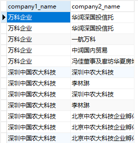
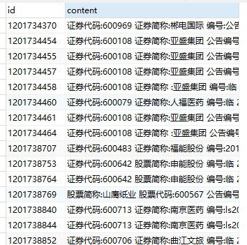

# Deepdive 实验
---

## 0 实验前安装软件

1. postgresql
2. deepdive
3. stanford nlp

## 1 实验一：通过Deepdive把csv数据导入PostgreSQL

### 1.1 创建相关文件夹和文件
```sh
# 创建项目文件夹夹
mkdir transaction-1

# 进入项目文件夹
cd transaction-1

# 创建数据文件夹
mkdir input

# 创建脚本文件夹
mkdir udf

# 创建用户配置文件
vim app.ddlog

# 创建模型配置文件
vim deepdive.conf

# 创建数据库配置文件
vim dd.url
```

### 1.2 数据库配置文件dd.url内容

连接postgresql的URL
```
postgresql://postgres@localhost:5432/testdb
```

### 1.3 把数据入到input文件夹下

transaction_dbdata.csv
```csv
万科企业,华润深国投信托
万科企业,华润深国投信托
万科企业,一航万科
万科企业,中润国内贸易
万科企业,冯佳董事及廊坊华夏房地产
```

### 1.4 app.ddlog内容

```ddlog
@source
transaction_dbdata(
	@key
	company1_name text,
	@key
	company2_name text
).
```

### 1.5 执行命令导入

```sh
deepdive compile
deepdive do transaction_dbdata

# 按ESC键
# 按":"键
# 输入wq
# 按回车
# 输入postgres的数据库密码
# 等待完成
```

PostgreSQL的数据库testdb的表transaction_dbdata的内容如下：



### 1.6 结论：

- 在执⾏app.ddlog前，如果有改动，需要先执⾏行行deepdive compile编译才能⽣生效 
- 对于不依赖于其他表的表格，deepdive会⾃自动去input⽂文件夹下找到同名csv⽂文件，在postgresql⾥里里建表导入
- 运⾏命令时，deepdive会在当前命令⾏里生成⼀个执⾏计划文件，和vi语法⼀样，审核后使⽤用:wq保存并执⾏。 


## 2 实验二：通过Deepdive把文章内容抽取导入PostgreSQL

### 2.1 articles.csv放到input文件夹

部分内容如下：

```
1201734454,证券代码:600108 证券简称:亚盛集团 公告编号:临2015-067   甘肃亚盛实业(集团)股份有限公司    第七届监事会第四次会议决议公告甘肃亚盛实业(集团)股份有限公司第七届监事会第四次会议于 2015 年 10 月 27 日上午 11:30 时在甘肃省兰州市城关区雁兴路 21 号公司 14 楼会议室召开，会议以现场方式进行，会议由监事会主席 李金有主持。会议应到监事 5 人，实到 5 人，监事崔伟女士因出差委 托监事王凤鸣先生代为出席本次会议，并发表同意意见。本次会议的 召开符合<公司法>、<证券法>、<公司章程>等的有关规定，会议合 法有效。
1201734455,证券代码:600108 证券简称:亚盛集团 公告编号:2015-068    甘肃亚盛实业(集团)股份有限公司     关于黑河黄藏寺水利枢纽工程      征占用土地及补偿的公告     本公司董事会及全体董事保证本公告内容不存在任何虚假记载、 误导性陈述或者重大遗漏，并对其内容的真实性、准确性和完整性承 担个别及连带责任。
```

### 2.2 app.ddlog里添加如下内容

```
@source
articles(
	@key
	id text,
	@key
	content text
).
```

### 2.3 编译执行

```sh
deepdive compile
deepdive do articles
```

PostgreSQL的数据库testdb的表transaction_dbdata的内容如下：



### 2.4 Deepdive 通过sql语句操作PostgreSQL

```sh
deepdive sql "select id from articles"
```

结果

```
     id
------------
 1201734370
 1201734454
 1201734455
 1201734457
 1201734458
 1201734460
 1201734461
 1201734464
 1201738707
 1201738753
```

### 2.5 Deepdive 直接查询PostgreSQL

```sh
deepdive query "?- articles(id, _)."
```

结果

```
     id
------------
 1201734370
 1201734454
 1201734455
 1201734457
 1201734458
 1201734460
 1201734461
 1201734464
 1201738707
 1201738753
```

## 3 实验三：用NLP进行处理