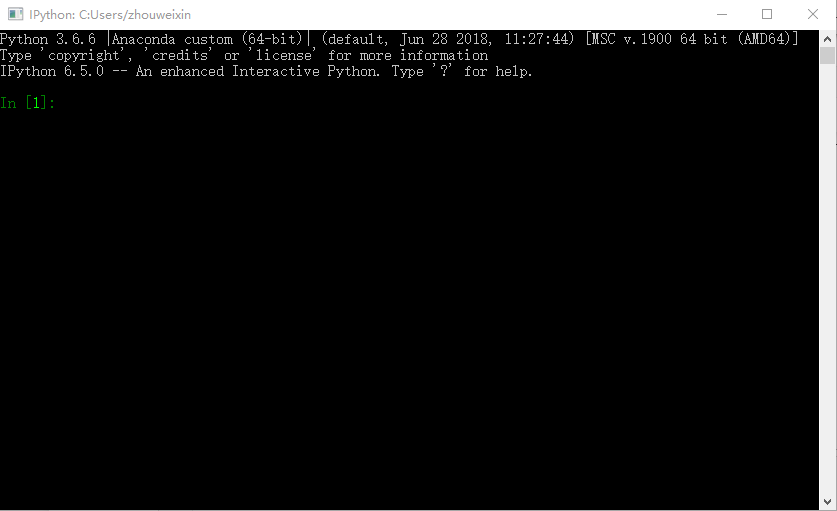
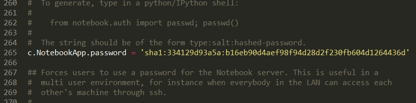

# jupyter-notebook设置固定密码用来远程登录
---

## Windows系统

### 1 windows + r 输入python或者ipython打开python环境

### 2 输入如下代码

```python
from notebook.auth import passwd

passwd()

# 输入两次密码
1234
1234
```



### 3 复制生成的sha1:***********************

### 4 打开jupyter-notebook配置文件，路径为【C:\Users\zhouweixin\.jupyter\jupyter_notebook_config.py】

### 5 找到【c.NotebookApp.password】

取消注释，把第3步生成的密码粘贴进去，保存即可，以后打开jupyter notebook就需要输入密码1234才可登录。如下图所示




