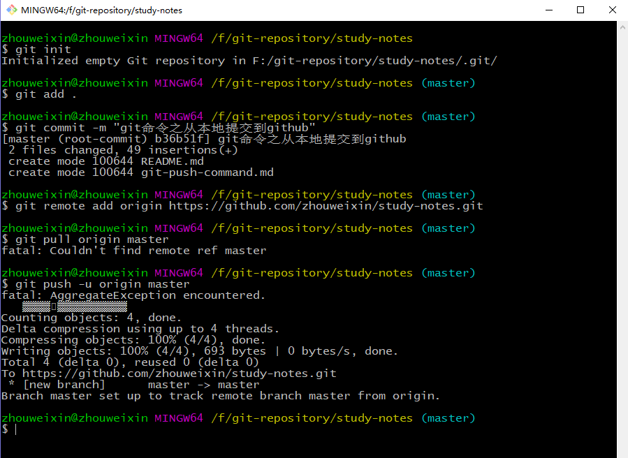

# git命令之从本地提交到github
---



# 1.建立git仓库

在文件夹下, 执行命令
```
git init
```

# 2.把文件添加到仓库中

## 2.1 添加所有文件

```
git add .
```

## 2.2 添加指定文件

```
git add filename
```

# 3.把添加的文件commit到仓库

```
git commit -m "注释内容"
```

# 4.在github创建仓库, 拷贝仓库url

# 5.本地仓库与github上的远程仓库关联

```
git remote add origin 仓库url
```

**注： 假如出现错误【fatal: remote origin already exists.】**

```
git remote rm origin
git remote add origin 仓库url
```

# 6.从github上拉取内容

```
git pull origin master
```

# 7.从本地上传到github上

```
git push -u origin master
```

